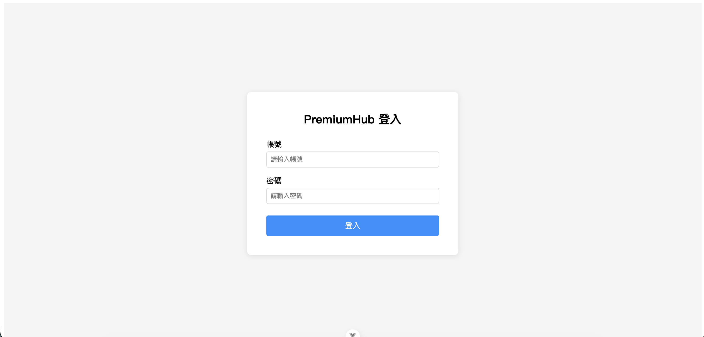
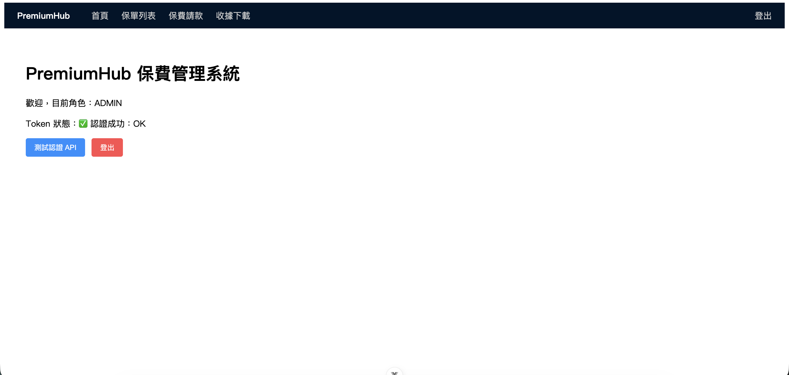
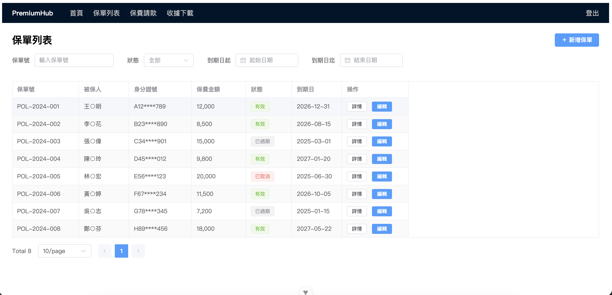
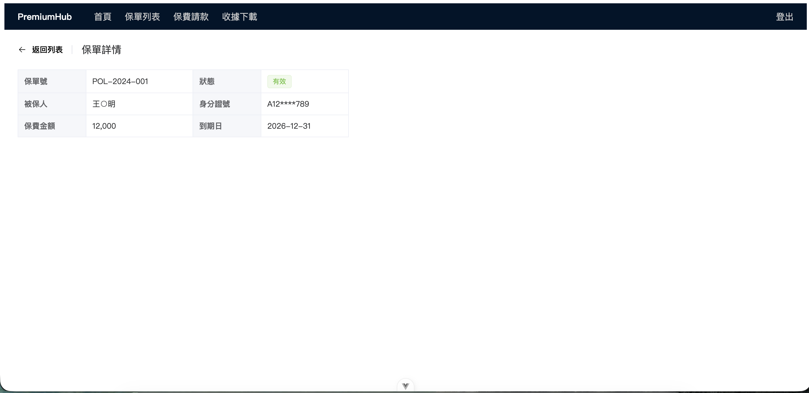
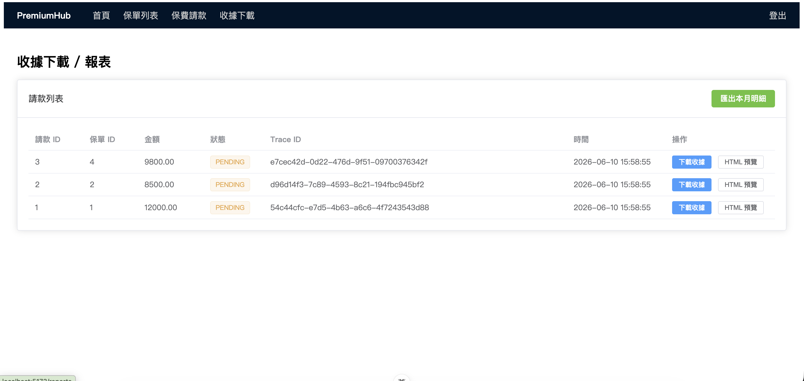
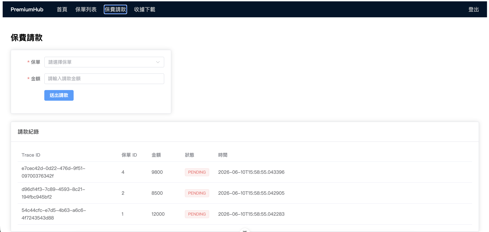
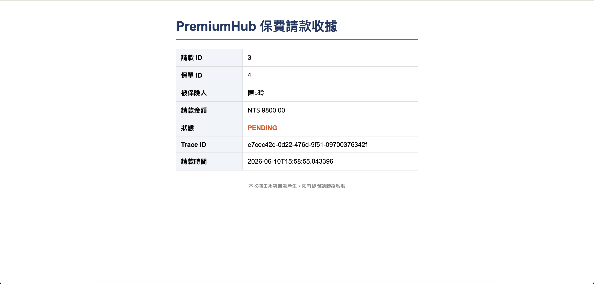
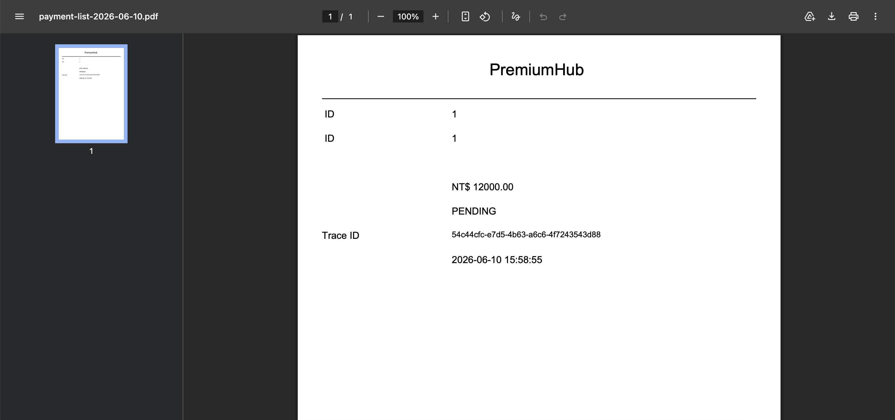

# PremiumHub — 保費管理系統

> 一個以「邊做邊學」為目標設計的 Java 全端專案，涵蓋金融系統常見的後端技術考點，適合作為 Java 工程師面試的實作展示。

## 技術棧

| 層級 | 技術 |
|------|------|
| 後端框架 | Spring Boot 3.5 / Spring Security / Spring Data JPA |
| ORM | Hibernate 6 + MyBatis（混用） |
| 資料庫 | H2 In-Memory（開發）/ PostgreSQL（生產） |
| 認證 | JWT（jjwt 0.12）+ BCrypt |
| 報表 | JasperReport 6.21 + Thymeleaf SSR |
| 前端 | Vue 3 + TypeScript + Element Plus + ECharts |
| 狀態管理 | Pinia |
| HTTP Client | Axios + Interceptor |
| 測試 | JUnit 5 + Mockito + JaCoCo |
| 建置 | Maven 3.9 / Vite |

## 3 行啟動指令

```bash
cd backend && mvn spring-boot:run
cd frontend && npm install && npm run dev
# 後端 http://localhost:8080　前端 http://localhost:5173
```

## 測試帳號

| 帳號 | 密碼 | 角色 | 可用功能 |
|------|------|------|---------|
| admin | password123 | ADMIN | 全功能（含核印授權、Dashboard） |
| user | password123 | USER | 保單查詢、請款、收據下載 |

## 功能模組

| Slice | 功能 | 路由 |
|-------|------|------|
| S1 | JWT 登入 / 自動 Refresh | `/login` |
| S2 | 保單查詢列表（分頁 + 篩選） | `/policies` |
| S3 | 保單新增 / 編輯（樂觀鎖） | `/policies/new` `/policies/:id/edit` |
| S4 | 保費請款（悲觀鎖 + 防重複扣款） | `/payments` |
| S5 | 管理員核印授權（RBAC） | `/seal-auth` |
| S6 | 收據 PDF 下載 / HTML 預覽 | `/reports` |
| S7 | Dashboard 統計 + ECharts 折線圖 | `/dashboard` |

## 截圖預覽

### 登入


### 首頁（JWT 認證狀態）


### 保單列表（姓名遮罩 王○明 / 身分證遮罩 A12\*\*\*\*789）


### 保單詳情


### 保費請款（Trace ID 全程追蹤）


### 收據下載頁（JasperReport PDF + Thymeleaf HTML 預覽）


### Thymeleaf SSR HTML 收據預覽（Server-Side Rendering）


### JasperReport PDF 收據（流式輸出防 OOM）


## 專案結構

**backend/**
- `config/` — SecurityConfig, CorsConfig, DataInitializer
- `controller/` — AuthController, PolicyController, PaymentController, SealAuthController, ReportController, DashboardController
- `dto/` — Request / Response / Projection DTO
- `entity/` — JPA Entity（Policy, Payment, SealAuth, AuditLog, SysUser）
- `repository/` — JPA Repository + MyBatis Mapper
- `security/` — JwtUtil, JwtAuthenticationFilter
- `service/` — 核心業務邏輯
- `src/test/` — JUnit 5 + Mockito 單元測試

**frontend/src/**
- `views/` — Vue 頁面元件
- `stores/` — Pinia 狀態管理（authStore）
- `router/` — Vue Router + Navigation Guard
- `utils/` — Axios 實例 + Interceptor

## JaCoCo 覆蓋率報告

```bash
cd backend && mvn verify
open target/site/jacoco/index.html
```

Service 層覆蓋範圍：AuthService / PaymentService / SealAuthService / DashboardService

## 面試考點對應表

| 考點 | Slice | 關鍵類別 |
|------|-------|---------|
| JWT + Spring Security Filter Chain | S1 | JwtAuthenticationFilter, JwtUtil |
| BCrypt 單向雜湊 | S1 | AuthService, PasswordConfig |
| Axios Interceptor 401 自動 Refresh | S1 | src/utils/axios.ts |
| MyBatis #{} vs ${} + SQL Injection 防護 | S2 | PolicyMapper.xml |
| AES 個資加密 + 遮罩（符合金融個資規範） | S2 | AesUtil, PolicyService |
| JPA 樂觀鎖 @Version + 409 Conflict | S3 | Policy entity, GlobalExceptionHandler |
| @Transactional rollbackFor + 自呼叫陷阱 | S4 | PaymentService |
| REQUIRES_NEW 獨立事務（稽核 Log） | S4 | AuditLogService |
| 悲觀鎖 PESSIMISTIC_WRITE + 冪等性（防高併發重複扣款） | S4 | PolicyRepository, PaymentService |
| MDC Trace ID 全程追蹤 | S4 | PaymentService |
| @PreAuthorize RBAC + @EnableMethodSecurity | S5 | SealAuthController, SecurityConfig |
| JPA N+1 → JOIN FETCH | S5 | SealAuthRepository |
| JasperReport 流式 PDF 輸出（防 OOM） | S6 | ReportService, ReportController |
| Thymeleaf SSR vs Vue CSR | S6 | ThymeleafController |
| JPQL GROUP BY 聚合查詢 | S7 | PaymentRepository, DashboardService |
| JaCoCo Maven plugin 覆蓋率門檻 | S7 | pom.xml |
| Hibernate 6 constructor expression 陷阱 | S7 | PaymentRepository（Object[] 解法） |
